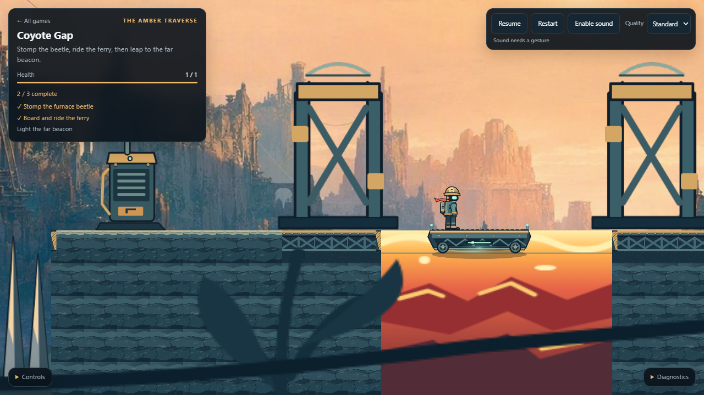
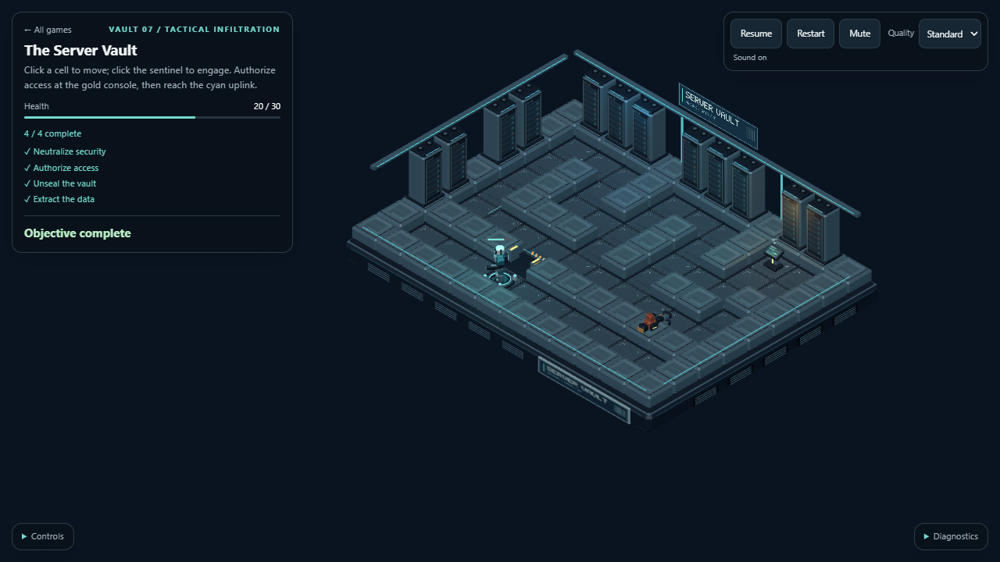
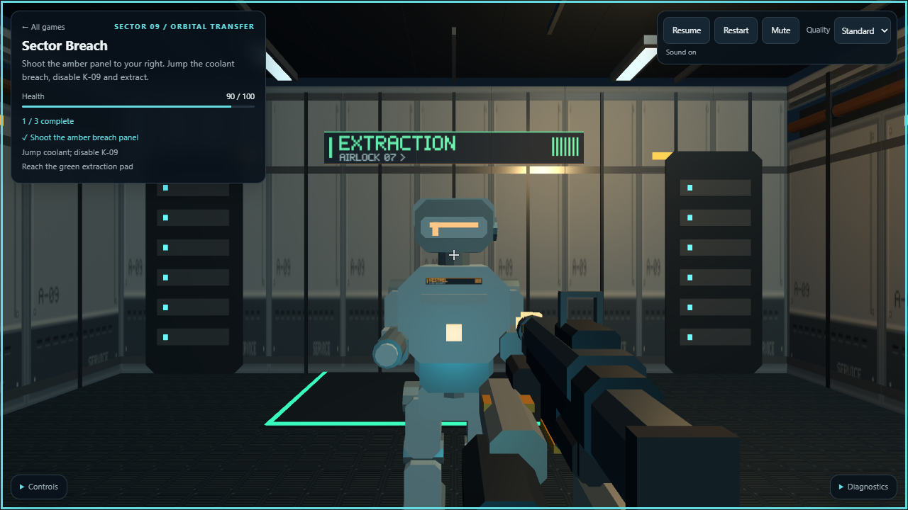
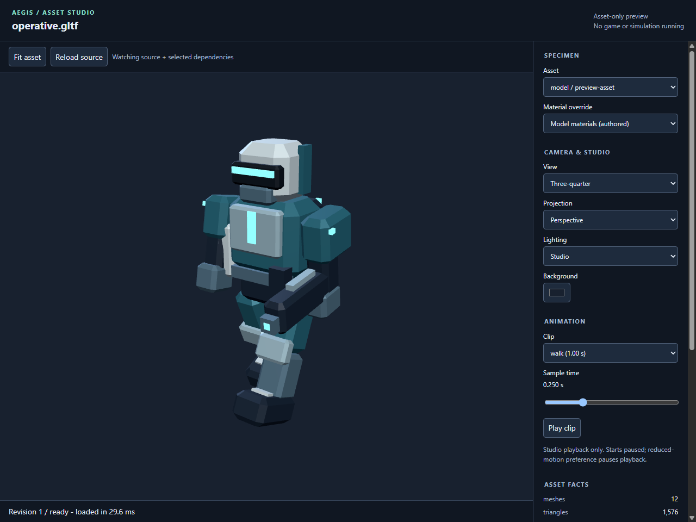

# Aegis

**An agent-first game engine. Author as data. Play by script. Inspect every tick.**

[](https://github.com/rumukh/aegis-engine/actions/workflows/ci.yml)
[](https://rumukh.github.io/aegis-engine/)

[**Play the demos**](https://rumukh.github.io/aegis-engine/) ·
[Quick start](#quick-start) ·
[Agent workflow](#the-agent-workflow) ·
[Asset studio](#iterate-on-assets-without-running-a-game) ·
[Architecture](#architecture) ·
[Roadmap](#status-and-roadmap)



_Coyote Gap, running in the browser. The same traversal can be executed and inspected entirely headlessly._

Aegis is a TypeScript engine built around a **deterministic, inspectable simulation** rather
than an editor application. Scenes, input scripts, prefab definitions and presentation manifests
are readable files. A coding agent can discover the available vocabulary, author content,
run a game, inspect its state and assert on outcomes through a consistent CLI and library API.

Humans get playable browser games, original asset-backed environments, animated characters,
audio and an interactive asset studio. Rendering is a consumer of the simulation, not a
prerequisite for it.

**Status:** an experimental reference engine with three established proof-of-concept games and
the fourth, survival-horror mission **NULL MERIDIAN**, undergoing integrated presentation review.
The long-term goal is an agent-first engine capable of supporting AAA production.
That is a roadmap, **not a claim that the current engine is AAA-ready**.

## What makes it agent-first?

An agent should not need to click through an editor, guess undocumented component names, or
infer gameplay success from a screenshot. Aegis makes the authoring and feedback loop explicit:

| An agent needs to...           | Aegis provides                                                                                                                                     |
| ------------------------------ | -------------------------------------------------------------------------------------------------------------------------------------------------- |
| Discover what it can author    | `aegis describe --json`: selected plugin, component defaults and schema facts, resource IDs, prefab declarations, system order and CLI operations. |
| Make reviewable changes        | Versioned JSON documents, stable string IDs, plain-text input scripts and inspectable asset recipes.                                               |
| Play without a keyboard        | Logical input such as `hold Right 0..120`, `press Jump @48`, `click 9,1 @308` and `aim 90 0 @8`.                                                   |
| Observe the actual game        | World queries, canonical snapshots, event history, semantic camera frames and ASCII views.                                                         |
| Keep observations manageable   | Explicit entity pagination and resource selection, with matched/returned counts and honest truncation metadata.                                    |
| Know whether a change worked   | Named gameplay assertions, per-tick invariants, pinned state/trajectory hashes and record/replay.                                                  |
| Repair bad content             | Structured diagnostics with stable codes, locations and actionable fixes.                                                                          |
| Iterate visually with a person | An asset-only studio and PNG captures using the production loaders, without booting a game.                                                        |

**Agent-first does not mean agent-only.** The games accept keyboard/mouse and standard-mapped
controllers. The [browser-safe input API](docs/api/gamepad-input.md) also works in games that
own their renderer and animation loop.
Nor does it mean an LLM runs inside the engine: Aegis exposes tools that coding agents can use,
while authoritative gameplay remains explicit code and data.

## Four games, one engine

Each PoC has its own composed game plugin, authored level, input script, win/lose cases and
asset-backed presentation. They are practical examples of the engine's boundaries, not
unrelated render demos.

### Coyote Gap: The Amber Traverse

[Play the platformer](https://rumukh.github.io/aegis-engine/play/platformer/) ·
[Game guide](docs/games/platformer.md) ·
[Source](games/platformer)

Cross a cliffside industrial route, stomp the furnace beetle, ride a ferry over lava and reach
the far beacon. The playthrough exercises **tile collision, coyote time, jump buffering,
moving-platform carry and hazards**. Layered scenery, sprite animation, terrain textures and
event-driven effects stay outside authoritative gameplay.

**Controls:** A/D or arrow keys to run; Space/W/Up to jump.
**Controller:** left stick or D-pad to run; A to jump. The stick preserves analog speed.

### The Server Vault



[Play the isometric game](https://rumukh.github.io/aegis-engine/play/iso/) ·
[Game guide](docs/games/iso.md) ·
[Source](games/iso)

Infiltrate a security facility, engage the sentinel, authorize access and extract the data.
The route exercises **A\* pathfinding, patrol and detection, line of sight, combat,
blocked-path handling and a dynamically opened door**. Articulated glTF actors, low tactical
partitions and readable console/door states keep the map legible.

**Controls:** click the floor to move; click the guard to attack-move.
**Controller:** left stick moves the on-screen cursor; A orders movement or attack-move through
the same picker as the mouse.

### Sector Breach



[Play the FPS](https://rumukh.github.io/aegis-engine/play/fps/) ·
[Game guide](docs/games/fps.md) ·
[Source](games/fps)

Shoot the access panel, breach the blast door, jump the coolant pit and survive the security
encounter. This slice exercises **capsule movement, wall sliding, mouse look, raycasting,
hitscan and triggers**. The presentation adds an authored facility, a weapon viewmodel,
animated machinery and enemy feedback without changing the aim or collision model.

**Controls:** WASD to move, Space to jump, click the canvas for mouse look, left-click to fire.
**Controller:** left stick to move, right stick to look, A to jump, RT to fire. Controller look
does not require clicking the canvas or capturing the mouse.

### NULL MERIDIAN

[Play NULL MERIDIAN](https://rumukh.github.io/aegis-engine/play/horror/) ·
[Game guide and acceptance limits](docs/games/horror.md) · [Source](games/horror)

Investigate an abandoned orbital station, diagnose and restore auxiliary power, recover the
crew evidence, evade a corrupted rescue responder and depart. **No gun combat.** Spatially
gated interactions, recoverable system-routing decisions, sight/noise detection and real
chase/search/evasion run in the deterministic simulation.

**Controls:** WASD/mouse; E interacts, Q selects a labeled option, C crouches, Shift sprints,
F toggles the flashlight. **Controller:** sticks move/look; A interacts, X selects, B crouches,
LB sprints, Y toggles the light. See the guide for the measured foreknowledge route and the
still-required human duration/presentation review.

All four games expose pause/resume, restart, mute, quality controls and collapsible diagnostics.
Keyboard controls also include **P** to pause, **R** to restart and **.** to step a paused game.
On a standard-mapped controller, **Menu** pauses/resumes and **View** restarts.
Open a game, press a controller button so the browser exposes it, then release all controls to
arm input. Refocusing, reconnecting and resuming likewise require neutral controls. The
**Controls** panel lists bindings; **Diagnostics** reports connection and rearm status.
Browser audio still requires a click or key gesture; use **Enable sound**.

Controller support is shared by `npm run play` and the static demos, with no separate gamepad
build or configuration. Automated controller coverage drives all four games with
virtual standard-mapped devices; physical controller/driver compatibility is not claimed.

The screenshots are actual browser renders of the shipped PoCs, not concept art or mockups.
See their [capture notes](docs/images/captures.json).

## Quick start

### Requirements

- **Node.js 24 and npm 11** are the recommended toolchain; CI uses Node 24.
- Git, to clone the workspace.
- Chrome or Edge with WebGL for browser capture and asset preview. **Headless simulation does
  not require a browser or GPU.** Human play uses a compatible browser.

The examples below use **PowerShell and Windows paths**. On other shells, use the equivalent
directory-change command and path separators.

```powershell
git clone https://github.com/rumukh/aegis-engine.git
Set-Location aegis-engine
npm ci
npm run build
npm run play
```

Open **http://127.0.0.1:5173** and choose a game. Stop the server with Ctrl+C.

> **Package registry:** this repository's `.npmrc` selects a corporate npm proxy. If that proxy
> is not available in your environment, install with
> `npm ci --registry=https://registry.npmjs.org/` instead. Inside the configured corporate
> environment, keep using its proxy. See [ENVIRONMENT.md](ENVIRONMENT.md) before changing
> dependencies or registry configuration.

Build before using the CLI. Packages are currently private workspace packages: these
instructions use the repository checkout, not a globally published Aegis package.

### Run the same game without a window

```powershell
npx aegis run games\platformer\levels\coyote-gap.scene.json --ticks 400 --input games\platformer\play\coyote-gap.input --json
npx aegis test
```

The first command runs the composed Coyote Gap plugin selected by its `aegis.json`.
The second discovers the built gameplay specifications, including winning and losing routes
across all three PoCs. No browser is started.

## Engine capabilities

| Area                 | Available today                                                                                                                                                                            |
| -------------------- | ------------------------------------------------------------------------------------------------------------------------------------------------------------------------------------------ |
| **Simulation core**  | Entity-component-system storage, generation-checked handles, stable query order, fixed-step scheduling, explicit system phases, before/after ordering, seeded PRNG and deterministic math. |
| **State and events** | Canonical snapshots, checked restoration, world cloning, resource singletons, immutable recorded event payloads, state hashes and a separate event-stream digest.                          |
| **Content**          | `scene/1`, `prefab/1` and `tilemap/1`; typed scene builder; registered components/resources; prefab expansion, namespaced inherited children and pre-instantiation diagnostics.            |
| **Gameplay modes**   | Platformer movement/collision/cameras, isometric navigation/combat/cameras, and first-person movement/raycasting/hitscan/cameras. Games extend modes through `ModePlugin`.                 |
| **Harness**          | Scripted input, headless runs, world/history queries, semantic frames, ASCII views, reusable game tests, named assertions, live/history invariants and recording/replay.                   |
| **Presentation**     | Optional three.js adapters, real local textures and glTF/GLB models, materials, atlas animation, model clips, lights, fog, parallax, instanced decoration and bounded event effects.       |
| **Audio and UI**     | Gesture-unlocked audio, event cues and ambience, mute/pause/restart behavior, objective/health/progress HUD, quality tiers and diagnostic views.                                           |
| **Asset iteration**  | Direct model/image preview, declared material and atlas-frame selection, orbit and clip scrubbing, watched reload, warm capture API and PNG provenance sidecars.                           |
| **Delivery**         | Browser dev server and self-contained static export, including relative module/asset URLs for deployment under a path prefix.                                                              |

### Content remains data

Scenes describe entities and resources. A game plugin declares the vocabulary and systems that
make those entities meaningful. A nearby `aegis.json` tells the CLI which plugin to import:

```json
{
  "plugin": "@aegis/game-platformer#coyoteGapPlugin",
  "tests": ["./dist/*.gametest.js"]
}
```

That is the shipped platformer configuration. A new game supplies its own module/export.
The CLI reports the selected plugin and installed systems instead of quietly substituting
a bare movement mode for game logic.

Prefab instances merge component data and inherit or explicitly replace child lists.
Inherited descendants receive qualified IDs such as `left/child` and `right/child`;
scene-authored child IDs retain their existing identity. Reference cycles, expanded ID
collisions and conflicting authored `Name` values are diagnosed before spawning.

Authoritative tilemaps are currently **inlined into scene resources**. A neighboring standalone
tilemap file is not automatically loaded. Resource IDs must be declared by the active plugin
or explicitly supplied through the shared scene context.

## The agent workflow

```text
discover -> author -> validate -> simulate -> inspect -> assert -> iterate
                                  |
                           record / replay

asset edit -> standalone preview -> operator review -> reload
```

### 1. Discover, rather than guess

```powershell
npx aegis describe --mode platformer --json
npx aegis describe games\iso\levels\server-vault.scene.json --json
```

The versioned `capabilities/1` response exposes actual plugin declarations and supported CLI
operations. It does not create a world or run game systems. Unknown facts remain explicitly
unavailable: for example, resource value schemas and complete action/event inventories are
not inferred from arbitrary gameplay code.

### 2. Validate authored content

```powershell
npx aegis validate games\platformer\levels\coyote-gap.scene.json --json
npx aegis validate poc\previews\asset-studies.presentation.json --json
```

Scene validation checks the selected game's vocabulary. Presentation validation is
**structural**: it does not prove that every referenced file decodes or that a game entity
exists. Asset preparation and rendering provide those separate observations.

### 3. Inspect the state you actually need

```powershell
npx aegis inspect games\iso\levels\server-vault.scene.json --tick 0 --view world --limit 2 --offset 1 --resources summary --json
npx aegis inspect games\platformer\levels\coyote-gap.scene.json --tick 175 --input games\platformer\play\coyote-gap.input --view ascii
```

World output distinguishes **total entities**, **matched entities** and **returned rows**.
Resource summaries are labeled as summaries, not full resource values. Pagination bounds
the response, not the cost of simulating the preceding ticks.

Semantic frames provide camera-relative visibility, projected positions and depth as data.
ASCII views are useful spatial summaries; exact component state remains the authority.

### 4. Assert on gameplay, not just screenshots

This JavaScript example runs from the repository root after the workspace build:

```js
import { readFile } from 'node:fs/promises';
import { Transform } from '@aegis/core';
import { expectSim, runScene } from '@aegis/harness';
import { coyoteGapPlugin } from '@aegis/game-platformer';

const result = await runScene('games\\platformer\\levels\\coyote-gap.scene.json', {
  plugin: coyoteGapPlugin,
  ticks: 400,
  seed: 'poc-platformer',
  input: await readFile('games\\platformer\\play\\coyote-gap.input', 'utf8'),
  captureHistory: true,
});

expectSim(result)
  .eventEmitted('level.completed', 1)
  .eventEmitted('enemy.killed', 1)
  .eventEmitted('platform.boarded', 1)
  .eventNotEmitted('player.died')
  .hashEquals('d813e4e19db7444d');

result.assertInvariant('the player stays above the kill plane', (world) => {
  const player = world.query({ has: ['Player', 'Transform'] }).one();
  return player.get(Transform).position.y > -4;
});
```

The literal hash is the existing pinned Coyote Gap result, not a value copied from the run
being checked. Named events explain what broke; the hash detects additional state drift.
For reusable specifications, use `defineGameTest` and put TypeScript game tests where the
build emits discoverable `*.gametest.js` modules. See the [full agent guide](AGENTS.md).

### 5. Record and reproduce

```powershell
npx aegis record games\platformer\levels\coyote-gap.scene.json --ticks 400 --input games\platformer\play\coyote-gap.input --out coyote.replay.json
npx aegis replay coyote.replay.json --json
```

The determinism contract includes **scene/content revision, plugin/engine revision, input,
seed and fixed tick rate**. New recordings preserve their rate, and replay checks their
pinned final state and available per-tick timeline. Legacy recordings without a rate remain
readable, but the missing historical fact is reported rather than invented.

World hashes do not include the event log; `events.digest()` covers that separately.
A final-state hash also cannot describe when every beat occurred, so the PoCs additionally
pin trajectories and meaningful event timing. GPU pixel identity across machines is not
part of the gameplay determinism contract.

## Iterate on assets without running a game



The asset studio uses the **same production loaders and materials** as the games. It accepts
a local asset directly: no scene file, game plugin, collision setup or scripted playthrough
is needed.

```powershell
npx aegis preview games\iso\assets\operative.gltf --clip walk --time 0.25 --out operative.png --json
npx aegis preview games\iso\assets\operative.gltf --serve --watch --out-dir reviews --json
npx aegis preview poc\previews\asset-studies.presentation.json --asset-root . --material deck --shape sphere --out deck.png --json
```

The persistent page supports orbit/pan/zoom, reset-to-fit, lighting/background selection,
animation playback and scrubbing, plus model, texture, atlas-frame and material selection
from a descriptor. Asset edits reload without rebuilding the workspace or starting a game.

Each capture pairs a PNG with a `.preview.json` sidecar containing source/dependency
fingerprints, the rendered revision, selection, camera, clip/time, dimensions and timing.
Failed or still-loading revisions cannot masquerade as fresh captures of the last-good image.
If an edit invalidates the selected animation, the operator can explicitly select a valid
clip or rest pose rather than restart the workbench.

Use the warm Node/HTTP capture API for repeated automation. A local Windows measurement over
11 PoC reload-and-capture samples at 640 by 480 pixels had a **130 ms median**, including PNG
and sidecar publication. Cold browser startup is separate and slower; this is a measured
example, not a cross-machine performance guarantee.

[Asset studio reference](docs/api/asset-preview.md) ·
[Ready-made asset studies](poc/previews/asset-studies.presentation.json)

## CLI at a glance

| Command          | Purpose                                                                     |
| ---------------- | --------------------------------------------------------------------------- |
| `aegis describe` | Discover a selected plugin's vocabulary, schedule and supported operations. |
| `aegis scaffold` | Generate a game, scene, tilemap, prefab or game-test starter.               |
| `aegis validate` | Validate scene, prefab, tilemap or presentation documents.                  |
| `aegis run`      | Execute a headless simulation from a scene and optional input script.       |
| `aegis inspect`  | Inspect world state, a semantic frame or an ASCII view at a tick.           |
| `aegis test`     | Discover and execute compiled gameplay specifications.                      |
| `aegis record`   | Save a replay recording with input, seed, rate and state hashes.            |
| `aegis replay`   | Re-execute a recording and report mismatches.                               |
| `aegis preview`  | Render and iterate on individual assets without a game.                     |

Use `npx aegis <command> --help` for exact options. Most commands support `--json`.
The [agent workbench reference](docs/api/agent-workbench.md) explains selection precedence,
diagnostics, discovery limits and bounded inspection.

## Architecture

The repository contains **eight engine packages and four game workspaces**, with TypeScript
project references and mechanically enforced dependency boundaries.

| Package                                                  | Responsibility                                                                                                  |
| -------------------------------------------------------- | --------------------------------------------------------------------------------------------------------------- |
| [`@aegis/core`](packages/core/src)                       | ECS, scheduler, input types, PRNG, math, events, queries, serialization and hashing; zero runtime dependencies. |
| [`@aegis/content`](packages/content)                     | Content documents, component/resource registries, prefab expansion and validation.                              |
| [`@aegis/harness`](packages/harness/src)                 | Shared scene initialization, headless execution, scripted input, observations, assertions and replay.           |
| [`@aegis/mode-platformer`](packages/mode-platformer/src) | Side-scrolling movement, collision and views.                                                                   |
| [`@aegis/mode-iso`](packages/mode-iso/src)               | Grid navigation, orders, combat and isometric views.                                                            |
| [`@aegis/mode-fps`](packages/mode-fps/src)               | First-person movement, geometry queries, hitscan and views.                                                     |
| [`@aegis/render-three`](packages/render-three)           | Read-only rendering, assets, audio/UI, browser hosting, static export and asset preview.                        |
| [`@aegis/cli`](packages/cli/src)                         | The common command-line surface.                                                                                |

**Core does not depend on rendering. Modes do not depend on each other. The harness does
not import a concrete mode.** A game's `ModePlugin` composes registered components,
resource/prefab declarations, initialization, systems and observation providers.

`poc/platformer.mjs`, `poc/iso.mjs`, `poc/fps.mjs` and `poc/horror.mjs` connect each game to its presentation.
Engine packages never import the PoC games.

The dev server hosts the simulation in Node and sends snapshots to a browser mirror.
The static build runs the same simulation locally in the page and still renders through a
detached mirror. Asynchronous asset loading, audio and view-only effects do not become
authoritative gameplay inputs.

[Architecture](docs/architecture.md) · [Design decisions](docs/adr)

## Verification and shipping

```powershell
npm run verify
npm run build:site
```

`verify` runs the workspace build, test type-checking, unit/integration and gameplay suites,
browser suites where supported, ESLint, dependency-boundary checks and formatting.
The test wrapper audits the runner's report: missing execution and skipped cases are not
silently treated as a clean pass.

CI runs on Windows and Ubuntu. Browser suites run on Ubuntu CI and local workstations;
they are explicitly excluded on hosted Windows runners, not reported as passing there.
The [rationale and limitations](docs/adr/0010-browser-specs-do-not-run-on-hosted-windows.md)
are documented.

`build:site` writes a self-contained `dist-site` with the playable pages, reachable JavaScript
modules and prepared assets. It supports deployment beneath a URL prefix and requires no
game backend. The repository's [Pages workflow](.github/workflows/pages.yml) publishes the
[live demos](https://rumukh.github.io/aegis-engine/).

## Status and roadmap

The current engine is deliberately small enough to understand and exercise through its
four demos. It is not yet a general-purpose production replacement for established AAA tools.

| Stage                                        | Direction                                                                                                                       |
| -------------------------------------------- | ------------------------------------------------------------------------------------------------------------------------------- |
| **Reference foundation / current milestone** | Deterministic simulation, agent tools, shared asset-backed presentation, existing PoC showcases and standalone asset iteration. |
| **Scalable runtime and content**             | Workload-driven storage/observation improvements, cooking and streaming; native hot paths only when measurements justify them.  |
| **Production characters and worlds**         | Richer animation systems, physics/navigation, persistent-state migrations and larger-world authoring.                           |
| **Production operations and platforms**      | Large-project workflows, incremental packaging, platform integration and continuous performance/crash diagnostics.              |

Important current boundaries: simplified mode-specific physics, no built-in multiplayer
stack, no complete save-game product layer, no large-world streaming/native backend, and no
production animation-graph or console-integration pipeline. Presentation currently omits
dynamic shadows, postprocessing and external compression-decoder services. Loading requires
supported local asset formats and a valid dependency closure.

[Production roadmap](docs/production-roadmap.md) · [Project charter](CHARTER.md)

## Documentation and asset provenance

- [**AGENTS.md**](AGENTS.md): the complete author/run/observe/debug loop, with reproducible
  examples and known traps.
- [**Agent workbench**](docs/api/agent-workbench.md): discovery, structural validation and
  bounded observations.
- [**Asset preview**](docs/api/asset-preview.md): studio controls, automation, reload behavior,
  capture recipes and timing semantics.
- [**Presentation package**](packages/render-three/README.md): assets, animation, effects,
  audio, browser hosting and static delivery.
- [**Environment**](ENVIRONMENT.md) and [**working agreement**](docs/working-agreement.md):
  toolchain, dependency policy, package ownership and contribution expectations.

The PoC asset directories retain original source recipes and provenance:
[platformer](games/platformer/assets), [iso](games/iso/assets) and [FPS](games/fps/assets).
Respect each asset's recorded authorship and licensing; do not infer ownership from a
successful preview. Procedural assets have reproducible recipes. The platformer's generated
canyon background instead retains its creative prompt and canonical image; service
regeneration is not claimed to be byte-identical.
