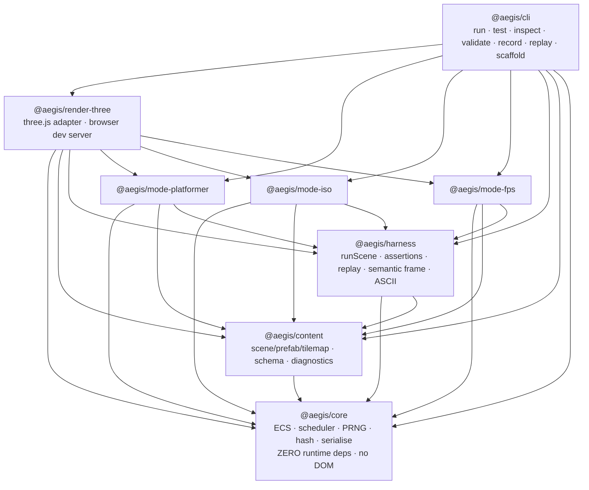
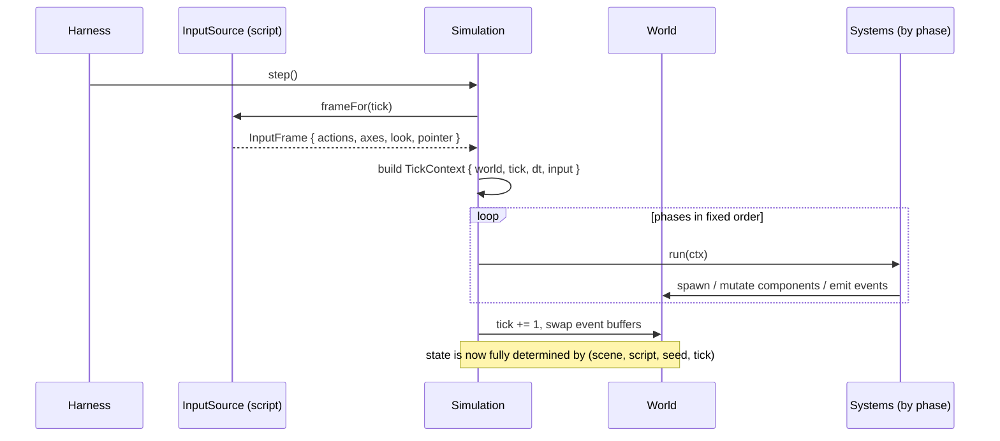
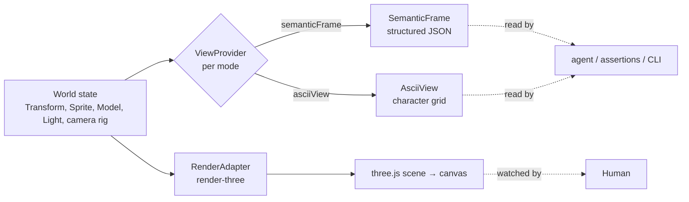
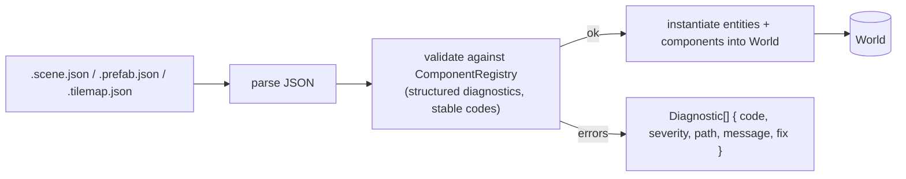

# Aegis Architecture

> How the engine is put together, why the boundaries are where they are, and what happens on a
> single tick. This document is binding on all implementation sessions. Every decision here is
> backed by an ADR in [`docs/adr/`](./adr); this file is the map, the ADRs are the rationale.

Aegis inverts the mainstream engine. Instead of a GUI application with an optional scripting
layer, Aegis is a **library with a machine-readable world model** and an _optional_ renderer.
The simulation is pure, deterministic computation over plain data; pixels are an output adapter
bolted on afterwards. Everything below serves the nine principles in [`CHARTER.md`](../CHARTER.md).

## 1. Package graph

Eight packages in an npm-workspaces monorepo, wired with TypeScript project references. The
dependency graph is a strict DAG — enforced mechanically by
[`scripts/check-deps.mjs`](../scripts/check-deps.mjs) (at both the `package.json` and the
`import`-statement level) and by determinism lint rules in
[`eslint.config.js`](../eslint.config.js).



| Package                  | Depends on                               | Responsibility                                                                                            |
| ------------------------ | ---------------------------------------- | --------------------------------------------------------------------------------------------------------- |
| `@aegis/core`            | **nothing**                              | Deterministic ECS, fixed-timestep scheduler, seeded PRNG, event bus, world serialisation, query, hashing. |
| `@aegis/content`         | core                                     | Declarative scene/prefab/tilemap format, schema validation, structured diagnostics with stable codes.     |
| `@aegis/harness`         | core, content                            | Run a scene N ticks under an input script; gameplay assertions; replay; semantic frame + ASCII view.      |
| `@aegis/mode-platformer` | core, content, harness                   | 2D side-scroller: gravity, tile collision, coyote time, jump buffer, follow camera.                       |
| `@aegis/mode-iso`        | core, content, harness                   | Isometric grid world: pathfinding, click-to-move, turn/real-time movement.                                |
| `@aegis/mode-fps`        | core, content, harness                   | First-person 3D: capsule movement, mouse-look, hitscan.                                                   |
| `@aegis/render-three`    | core, content, harness, mode-\*, `three` | three.js render adapters for all modes; browser dev server. **Read-only consumer of the world.**          |
| `@aegis/cli`             | everything                               | The single command-line surface. No GUI is ever required.                                                 |

### The three load-bearing rules

1. **`core` depends on nothing.** No runtime dependencies, no DOM, no Node built-ins in its
   public path. It must run in a bare V8. This is what makes the whole engine headless and
   embeddable. (ADR-0002.)
2. **Rendering points inward, never outward.** `render-three` reads the world; the world never
   imports rendering. `core` importing `render-three` is a build-breaking violation. (ADR-0005.)
3. **Modes never depend on each other, and the harness never depends on a concrete mode.** Modes
   plug into the harness through the `ModePlugin` interface (ADR-0006), which keeps the graph
   acyclic and lets the five implementation sessions work in parallel without colliding.

## 2. Anatomy of one tick

Time is discrete and fixed. `Simulation.step()` advances the world by exactly `dt = 1 / tickRate`
seconds regardless of wall-clock (ADR-0001). Systems run once per tick, grouped into the fixed
phases in [`scheduler.ts`](../packages/core/src/scheduler.ts) — always in this order:

```
input → preUpdate → update → physics → postUpdate → events → cleanup
```

Within a phase, systems are ordered topologically by their `before`/`after` constraints, ties
broken by a stable insertion index — so ordering is total and deterministic.



Key invariants of the loop:

- **The only inputs to a tick are the world, the tick number, `dt`, and the `InputFrame`.** No
  system may read a clock or an unseeded RNG. Randomness comes from the world's seeded PRNG
  (`core/prng.ts`); "time" is the integer tick and the fixed `dt`. Enforced by lint.
- **Iteration order is deterministic.** Component storage is a sparse set iterated in ascending
  entity-index order (ADR-0002), so every system visits entities in the same order every run.
- **Events are double-buffered.** Systems emit into a write buffer during the tick; the
  `events` phase reads the buffer filled earlier this tick; `cleanup` swaps. No event ordering
  depends on listener registration time.

## 3. Simulation ⇄ rendering decoupling

The simulation produces two completely different "views", and neither is required for it to run:

- **The semantic frame** (`harness/view.ts`) — a structured description of what the camera would
  show: every visible entity with its world position, projected screen position, depth, layer,
  occlusion and a glyph. Plus the **ASCII view** for 2D modes. This is how an agent "sees" the
  game with no GPU (principle 7). It is derived purely from world state, so it is deterministic
  and diffable.
- **The three.js render** (`render-three`) — the human's pretty pixels. The adapter reads
  `Transform` + appearance components (`Sprite`/`Model`/`Light`) and the active mode's camera
  rig, and mirrors them into a three.js scene once per displayed frame. It **never writes back**.

Both are _projections_ produced by a mode's `ViewProvider`; the difference is only the target
(structured data / character grid vs. GPU). Because the projection is mode-specific
(orthographic side-on, isometric, perspective) it lives in the mode package, while the shared
frame types live in the harness that orchestrates them.



## 4. Content: loading and validation

Scenes, prefabs and tilemaps are **canonical JSON** documents (ADR-0003) tagged with a schema
discriminator (`"aegis": "scene/1"`). The flow from file to running world:



- **Authoring** uses either raw JSON (diffable, tool-agnostic) or the typed `createSceneBuilder`
  builder (`content/builder.ts`) for type-safety and autocompletion — both emit the same document.
- **Validation is schema-driven and happens before anything runs** (principle 8):
  `parseScene` → `validateScene` → `instantiateScene` (`content/load.ts`). Every diagnostic
  diagnostic carries a stable `code` (e.g. `AEGIS_SCENE_UNKNOWN_COMPONENT`), a source `path`, a
  human message, and where possible a suggested `fix`. `Validated<T>` (`core/diagnostics.ts`) is
  the `{ value?, diagnostics }` envelope every validating API returns.
- **Component identity is a stable string** (`"Transform"`, `"Velocity"`), never a GUID
  (principle 1). The `ComponentRegistry` maps ids → `ComponentType`; core, content-visual and the
  active mode contribute their component sets before a scene loads.
- **Tilemaps store their grid as ASCII rows** with a glyph legend, so a level is human-readable
  and diffs line-by-line.

## 5. Threading and timing model

**Single-threaded and synchronous, by design.** The tick loop contains no `async`, no
`await`, no timers, no worker messages — introducing any of them would make tick order depend on
the event loop and destroy determinism (ADR-0001, principle 3).

- **Fixed timestep only.** `dt` is a constant `1 / tickRate` for the whole run. There is no
  variable-delta update and no wall-clock accumulator inside the simulation. Wall-clock pacing
  (running at 60 fps for a human) is the concern of the _outer_ loop — the dev server or a future
  real-time host — and is strictly a presentation detail layered on top of `step()`.
- **Async lives only at the edges.** `runScene(path, …)` is `async` solely because it may read a
  scene file from disk; once loaded, stepping is synchronous. The dev server is async because it
  binds a socket. The core simulation is a pure function of `(scene, script, seed, ticks)`.
- **No shared mutable global state.** All state lives in the `World`. Two simulations can run in
  the same process (or the same test file) without interfering, which is what lets Vitest run
  package suites in parallel.

## 6. How an agent uses all of this

The end-to-end authoring loop, entirely in text, via `@aegis/cli` (principle 9):

```
aegis scaffold scene level-1 --mode platformer   # generate a starting document
aegis validate levels/level-1.scene.json         # schema-check before running
aegis run levels/level-1.scene.json --ticks 240 --input play.input --ascii
aegis inspect levels/level-1.scene.json --tick 90 --view frame --query "has:Player"
aegis test                                        # run headless gameplay tests
aegis record … --out run.replay && aegis replay run.replay --verify   # prove determinism
```

The **input script** (`play.input`, ADR-0004) is the agent's hands; the **semantic frame / ASCII
view** are its eyes; the **assertion API** (§7) is how it knows it succeeded.

Two properties of the input DSL that ADR-0004 leaves implicit and the harness now enforces:
a recording is rendered in **source order**, because the compiler resolves overlapping `axis` /
`pointer` writes as last-source-order-wins (so ADR-0004's "lines reorder … independently" holds
for `hold`/`press`/`release` but not for the analog channels — a script that depends on line
order raises `AEG-HARNESS-0012`); and statements outside `[0, ticks)` are reported
(`AEG-HARNESS-0009`…`0011`) rather than silently swallowed, so shortening a run cannot make a
whole script evaporate into a hash identical to "no input at all".

## 7. The assertion API — designed backwards from the ideal test

Principle 6 says gameplay is verified by assertions, not eyeballs. We designed the whole harness
by first writing the test we wanted to read, then building the contracts to make it real. This is
that test:

```ts
import { defineGameTest, expectSim } from '@aegis/harness';
import { platformerPlugin } from '@aegis/mode-platformer';
import { hashString, Transform } from '@aegis/core';
import type { StateHash } from '@aegis/core';

/**
 * The golden state hash of this playthrough, pinned as a **literal**. Derive it once from a
 * green run (`aegis run … --hash`), paste it here, and change it only deliberately.
 * Never write `hashEquals(result.hash)` — that compares a value to itself, can never fail,
 * and pins nothing. ESLint rejects it (`no-restricted-syntax`).
 */
const GOLDEN_HASH = 'a1b2c3d4e5f60718';

/**
 * The whole per-tick timeline, digested. `GOLDEN_HASH` says where the run *ended*; it is blind
 * to a change that diverges and then reconverges. Measured: moving one iso click from t340 to
 * t420 shifted `mission.completed` by 80 ticks and left the final hash **byte-identical**. Pin
 * both, or you are pinning the destination and not the route.
 */
const GOLDEN_TRAJECTORY = '0f1e2d3c4b5a6978';
const trajectoryDigest = (tickHashes: readonly StateHash[]): StateHash =>
  hashString(tickHashes.join('|'));

export default defineGameTest({
  name: 'player clears the gap and reaches the goal',
  scene: 'games/platformer/levels/1-1.scene.json',
  options: { plugin: platformerPlugin },
  ticks: 240,
  seed: 'poc-1',
  input: `
    hold Right 0..240      # run right the whole time
    press Jump @88         # jump the first gap
    press Jump @150        # jump onto the goal platform
  `,
  expect(result) {
    expectSim(result)
      .eventEmitted('level.completed', 1) // it actually finished, exactly once
      .eventNotEmitted('player.died') // and didn't die on the way
      .entityExists({ has: ['Player'] })
      .holds(
        'player ended past the goal line',
        (r) =>
          r
            .query({ has: ['Player', 'Transform'] })
            .one()
            .get(Transform).position.x >= 128,
      )
      .hashEquals(GOLDEN_HASH) // where the run ended — a literal, never result.hash
      .holds(
        'the per-tick hash timeline matches the golden trajectory',
        (r) => trajectoryDigest(r.tickHashes) === GOLDEN_TRAJECTORY, // …and how it got there
      );

    // A property that must hold on *every* tick, not just the last:
    result.assertInvariant(
      'never fell out of the world',
      (w) =>
        w
          .query({ has: ['Player', 'Transform'] })
          .one()
          .get(Transform).position.y > -5,
    );
  },
});
```

Why it reads well, and what each piece buys the agent:

- **`defineGameTest`** is a plain data literal — discoverable by `aegis test` _and_ runnable
  under Vitest, with no runner lock-in (`harness/assert.ts`). The scene, the ticks, the seed and
  the input script are all right there, diffable.
- **The input is the DSL** (ADR-0004): the test says, in words an agent wrote, exactly what was
  "played". Change a number, re-run, watch the assertion flip.
- **`expectSim(result)`** is a fluent chain of _gameplay_ assertions over the final world and the
  recorded event log — "did the level complete?", "is the player alive?", "where did it end up?".
- **`assertInvariant`** expresses safety properties across the whole timeline (requires
  `captureHistory`), while `Invariant`s passed to `runScene` fail _live_ at the first offending
  tick with an `InvariantError` naming the tick — so a broken jump points at _when_ it broke.
- **`hashEquals`** turns determinism into a one-line regression test: the golden hash is a byte
  for the entire final world state (ADR-0001). It only works against a **pinned literal**, and the
  reason is worth deriving rather than memorising: **a literal is the only value that was not
  produced by the run being checked.** `hashEquals(result.hash)` compares the run to itself, so it
  is vacuously true, cannot fail, and pins nothing — the exact shape of "looks like proof, isn't".
  The sharpest consequence is cross-platform: a self-comparison passes on Windows _and_ passes on
  Linux even when the two produce completely different worlds, because each compares itself to
  itself. A pinned literal is the only assertion shape that can pass on one OS and fail on the
  other, which makes it the instrument that CI's Ubuntu leg — and therefore ADR-0001's
  own-transcendentals bet — actually rests on. Derive it once from a green run and update it
  deliberately when you change the design on purpose. ESLint enforces this
  (`no-restricted-syntax`, `eslint.config.js`), and
  `harness/src/golden-hash.invariant.test.ts` enforces the part a syntactic rule cannot see.
- **`GOLDEN_TRAJECTORY`** pins the _route_, not just the destination. A final-state hash is blind
  to any change that diverges and reconverges, which is not hypothetical: moving one iso click
  from t340 to t420 shifted `mission.completed` by 80 ticks while leaving the final hash
  byte-identical. Each instrument is blind to what the next one catches — a self-comparison
  catches nothing, a pinned final hash catches end-state divergence including cross-OS, and a
  trajectory digest catches divergence anywhere in the timeline. Pin the last two.

> **On this section specifically.** The block above is a template by construction — it exists to
> be copied — so a defect in it propagates by copying rather than by reasoning. That is not
> theoretical: this section once taught `hashEquals(result.hash)`, and that line reached the
> harness's own tests and a shipped game verbatim, where it read as a determinism regression test
> and could never fail. The lint rule now closes the **code** channel permanently, but prose has
> no runner: a document is corrected only by a human reading it and asking what a line is _for_,
> which is a one-time act that nobody schedules. So the standard for anything written here is
> higher than "correct" — it must be **exemplary**, because it will be copied by readers who
> reasonably assume it already is.

Every assertion in this block reports **what was actually checked**, not just pass/fail:
`runGameTest` returns the number of assertions that really executed (a test whose `expect`
asserts nothing fails rather than reporting a clean pass), an unresolvable component reference
in a query is a loud failure rather than a filter that silently matches nothing, and a
`ticks: 0` run makes invariants fail rather than pass vacuously. The harness must always be
able to tell "verified" from "didn't check".

The object all of this reads from is `SimResult` (`harness/run.ts`): `world`, `hash`,
per-tick `tickHashes`, the `events` reader, `query(...)`, `frame(tick, viewOptions?)`,
`ascii(tick, viewOptions?)`, `at(tick)`, and `recording()`/`replay()`.

## 8. Contracts most likely to be renegotiated

Flagged here and to the PM because five sessions build against them in parallel:

- **`ModePlugin`** (`harness/plugin.ts`) — the mode ⇄ harness seam. If a mode needs to contribute
  something beyond `components() / systems() / view()` (e.g. per-run resources or a custom input
  binding), this interface grows first.
- **`ViewProvider` / `SemanticFrame`** (`harness/view.ts`) — the fps semantic frame is the least
  certain: `bounds`, `visibleFraction` and `occluded` may need refinement once real perspective
  projection exists.
- **`SimResult`** (`harness/run.ts`) — the surface every test reads. Additions are cheap;
  renames are expensive. Confirm shape before the game-dev sessions start.

### 8.1 Additive changes made under the freeze (PM-authorised)

All optional, all backwards compatible — no renames, no required fields, no removals:

| Contract         | Addition                                              | Why                                                                                                                                                      |
| ---------------- | ----------------------------------------------------- | -------------------------------------------------------------------------------------------------------------------------------------------------------- |
| `SemanticFrame`  | `totalEntities?`, `excludedEntities?`                 | A frame that lists 3 of a world's 6 entities was indistinguishable from a 3-entity world. The harness fills a truthful default when a provider does not. |
| `AsciiView`      | `overlaps?: AsciiOverlap[]`                           | A stacked cell erased the player glyph while the legend still advertised it, reading as "the player despawned".                                          |
| `SimResult`      | optional `options` argument on `frame()` / `ascii()`  | `ViewOptions.includeOffscreen` and `ViewOptions.ascii` were otherwise unreachable.                                                                       |
| `Invariant`      | `check` may return `{ ok, actual, expected, detail }` | A bare `false` cannot say what it saw.                                                                                                                   |
| `GameTestResult` | `assertions`, `checked`                               | Reports what a playthrough actually verified, so "asserted nothing" is not a pass.                                                                       |

`ViewProvider` implementers (`mode-platformer`, `mode-iso`, `mode-fps`) should populate
`SemanticFrame.totalEntities`/`excludedEntities` where they cull more precisely than the harness's
default, and `AsciiView.overlaps` where they rasterise by drawing entities in priority order —
`harness/testing/fake-mode.ts` is the reference implementation of both.

## 9. Where the ADRs live

| ADR                                                 | Decision                                              |
| --------------------------------------------------- | ----------------------------------------------------- |
| [0001](./adr/0001-determinism-strategy.md)          | float64 + controlled op order + owned transcendentals |
| [0002](./adr/0002-ecs-storage.md)                   | Sparse-set ECS, entity = index + generation           |
| [0003](./adr/0003-scene-format.md)                  | Canonical JSON scenes + typed builder                 |
| [0004](./adr/0004-input-scripting-format.md)        | Line-oriented input DSL → per-tick frames             |
| [0005](./adr/0005-rendering-adapter-boundary.md)    | Rendering is an inward-pointing read-only adapter     |
| [0006](./adr/0006-mode-module-boundary.md)          | Modes plug in via `ModePlugin`                        |
| [0007](./adr/0007-semantic-frame-and-ascii-view.md) | The two text views of the world                       |
| [0008](./adr/0008-assertion-api.md)                 | Gameplay assertions designed from the ideal test      |
