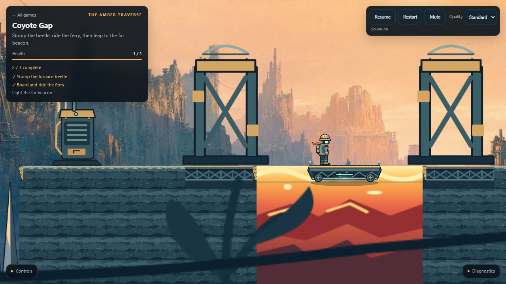
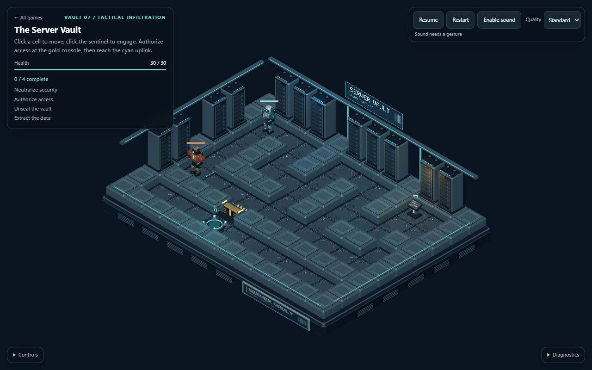
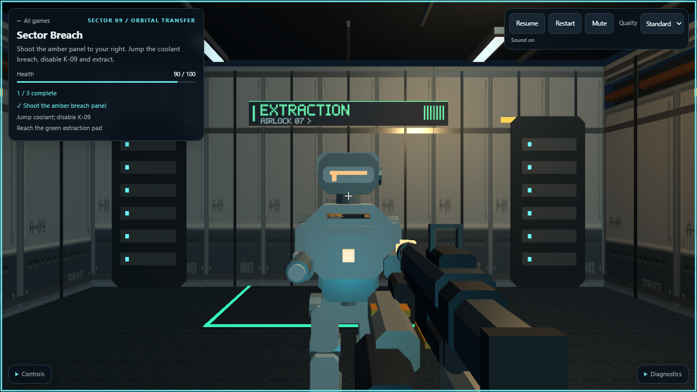

# M1 acceptance: the three playable slices

M1 brings the engine contracts, agent tools, shared presentation, standalone asset studio,
three authored showcases and measured runtime improvements together. It is a completed
reference-engine milestone, **not a claim of AAA production completeness**.

## Play

[Open the game collection](https://rumukh.github.io/aegis-engine/).

| Game          | Link                                                                      | Main controls                                            |
| ------------- | ------------------------------------------------------------------------- | -------------------------------------------------------- |
| Coyote Gap    | [Play platformer](https://rumukh.github.io/aegis-engine/play/platformer/) | A/D or arrows to run; Space to jump                      |
| Server Vault  | [Play isometric](https://rumukh.github.io/aegis-engine/play/iso/)         | Click floor to move; click the sentinel to engage        |
| Sector Breach | [Play FPS](https://rumukh.github.io/aegis-engine/play/fps/)               | WASD, Space, click to capture pointer/fire, mouse to aim |

All three have pause, restart, quality and sound controls. Sound requires a trusted user
gesture. The controls panel lists the full bindings. These are keyboard/mouse slices;
narrow-window coverage is not a claim of touch-control support.

The [asset studio](api/asset-preview.md) also previews their models, textures, materials and
animation poses independently, without initializing a world, plugin or game:

```powershell
npx aegis preview games\iso\assets\operative.gltf --clip walk --time 0.25 --serve --watch --out-dir reviews
```

## Gameplay and presentation acceptance

The browser suites drive the real input collectors through Chrome keyboard/pointer events,
using explicit time control for reproducible playthroughs. They do not substitute a second
gameplay implementation. Each game runs through both the dev host and a file-only static
host under a non-root URL prefix.

| Slice         | Accepted routes and beats                                                                                                                                     | Original winning final hash |
| ------------- | ------------------------------------------------------------------------------------------------------------------------------------------------------------- | --------------------------- |
| Coyote Gap    | 400-tick win; spikes, critter contact, missed coyote jump and corpse-at-goal losses; no-input ferry carry, stomp, coyote and buffered jumps, held victory art | `d813e4e19db7444d`          |
| Server Vault  | 960-tick win and 300-tick loss; patrol, detection, firefight, blocked door, switch, unsealing and extraction                                                  | `cb0f07007ad8608a`          |
| Sector Breach | 600-tick win, 300-tick pit loss and 200-tick wall slide; panel shot, coolant jump, combat, exit and near-wall viewmodel                                       | `f86540b793f071a3`          |

The original gameplay scenes, scripts, plugins and golden expectations were not rewritten to
make the browser routes easier. Their original trajectory digests remain
`79d373c4785825ca`, `faab0cbc899d293c` and `1ce5508ff97c0b75`, respectively. Coyote's browser
acceptance compares every winning tick; the other browser suites compare route boundaries
against independent headless runs, while their real-asset/headless cases retain full trajectory
checks. These are distinct evidence scopes, not interchangeable claims.

The durable suites are:

- [Coyote composition](../test/coyote-showcase.test.ts) and [browser acceptance](../test/coyote-showcase.browser.test.ts).
- [Vault composition](../test/vault-showcase.test.ts) and [browser acceptance](../test/vault-showcase.browser.test.ts).
- [Breach composition](../test/fps-presentation.test.ts) and [browser acceptance](../test/breach-showcase.browser.test.ts).

They cover actual input, loading and required-asset refusal/retry, trusted audio unlock,
mute/pause behavior, restart reuse, and release of assets and voices on disposal. Dev-client
reload restores persistent poses and HUD progress without replaying historical sound or
transient effects. A fresh static page starts a new run; persistence/save games are not implied.

### Defects found by running the showcases

**Vault picking:** a stale interpolated guard could steal the original tick-40 floor click,
moving detection from tick 178 to 176. Old observations now snap while recent steps retain
walking interpolation. The original event timings and route hashes are preserved.

**Vault framing:** the follow view placed a required switch offscreen at 390 by 844 pixels.
Its presentation profile now requests a stable level overview with 1.1 world units of padding,
fitted to the viewport. Critical actors, route cells and objectives remain outside the HUD
and control panels. The narrow view has approximately 18.11 pixels between adjacent projected
cells; small surface labels are not claimed to be equally legible there. Unrelated rear
decoration may overlap the desktop HUD. The default follow mode and authoritative `IsoCamera`
are unchanged.

**Breach depth:** the rifle previously vanished against nearby walls. A real foreground pass
now clears world depth before drawing the viewmodel with ordinary self-depth testing.
Weapon parts still occlude one another correctly; this is not a depth-disabled material hack.
Both clients use the same helper, restore renderer flags, and count both passes. Foreground
light copies are separately owned and disposed; the measured scene has four point lights in
each pass, eight physical point-light instances overall.

**Windows studio watcher:** the first published studio build exposed a Node 24.19 native
watcher abort when the host supplied an 8.3 short TEMP path. The failure was reproduced with
that exact runtime and repaired by expanding only the native watch directory. Logical paths,
junction retargeting, missing-file recovery and existing watcher behavior remain intact.
The repair passed the Windows and Ubuntu CI matrix in
[run 34533201186](https://github.com/rumukh/aegis-engine/actions/runs/34533201186).

## Reviewed in-game captures

These are unedited frames from the actual input-driven game runs, not asset contact sheets.
They were inspected for character and hazard readability, feet/deck alignment, usable routes,
camera framing and visible feedback. Motion and outcomes are established by the accompanying
routes and assertions, not by still images alone. [Capture metadata](m1/captures.json) records
the source commits, ticks, dimensions and byte hashes.

### Coyote Gap: the ferry carries the player with Right released



### Server Vault: stable overview and readable tactical route



[Narrow-window capture, 390 by 844](m1/vault-narrow.png).

### Sector Breach: combat and the depth-correct rifle



[Near-wall capture showing retained weapon self-occlusion](m1/breach-wall.png).

## Bounded resource use

The existing draw and payload limits remain 2,000 calls and 24,000 bytes, not larger limits
chosen after seeing the new assets. Measurements below are sampled game observations, not
portable maximum-throughput promises.

| Slice  | Sampled draw calls             | Sampled frame payload | Other observed bound                                                                                    |
| ------ | ------------------------------ | --------------------- | ------------------------------------------------------------------------------------------------------- |
| Coyote | 26-70 at captured beats        | 10,030-10,117 bytes   | 27 runtime files, 1,655,666 asset bytes; restart reuses texture identities                              |
| Vault  | 63 at 640 by 360               | 2,594 bytes           | 135 static placements in 11 batches; six model instances retained across restart                        |
| Breach | Up to 90, including foreground | Up to 19,723 bytes    | At most 18 sampled effects, below the low-tier limit of 32; six model instances retained across restart |

All three exercise zero retained asset/model/audio resources after their owned page disposal.
Browsers and local servers belong to their individual acceptance runs; teardown does not stop
the user's separately running asset studio.

## Runtime improvement: copy only new static observations

The previously deferred static-client optimization is now implemented. An unchanged
`(restart generation, tick)` reuses the detached mirror; first observation, advancing ticks
and same-tick restarts still use the original snapshot/restore isolation boundary.
Input, stepping, event delivery, presentation, drawing and HUD work continue on every frame.
Debug snapshots are defensive copies. Unsupported mirror writes heal on the next revision,
not on every paused frame, and cannot reach authoritative state.

[The real static-client regression suite](../packages/render-three/src/client/static-boot.test.ts)
covers copy counts, restarts, errors, input and five hostile observer cases: components,
resources, PRNG state, allocator reuse and events. In-memory substitution of the live world
for the mirror made all five positive isolation cases fail.

A paired run compared exact clients `cdae7f4` and `92837de` through 18 fresh-browser visits,
1,440 measured display frames and 90 blocks. Other modules matched between the two arms.
That measurement predates the foreground pass; it is not a measurement of the final FPS
renderer. The decisive count results were:

| Condition                      | Baseline copies per game  | Optimized platformer / iso / FPS |
| ------------------------------ | ------------------------- | -------------------------------- |
| 96 native paused frames        | 96 snapshot/restore pairs | 0 / 0 / 0                        |
| 48 controlled half-tick frames | 48 pairs                  | 24 / 23 / 23                     |
| 96 native active frames        | 96 pairs                  | 90 / 96 / 96                     |

Median snapshot/restore CPU time removed per paused display was approximately 0.200 ms,
0.116 ms and 0.313 ms on that machine. Active timing samples were noisy and sometimes slower:
the shared host was 61.5-100% busy, with large control outliers. **No general active FPS,
GPU-time or exclusive-hardware speedup is claimed.** The eliminated redundant copies, retained
per-frame behavior and authoritative isolation are the causal improvement.

The earlier output-compatible FNV optimization is also retained, along with its independent
reference and frozen renderer control. No gameplay pins or performance thresholds were loosened.

## Reproduce the integrated gate

```powershell
npm ci
npm run verify
npx aegis test --json
```

The full runner audits actual reports and refuses failures, skipped cases and an absent corpus.
Browser suites run serially within the workspace. CI exercises Windows and Ubuntu; hosted
Windows explicitly omits browsers under ADR-0010, so local Windows and Ubuntu browser runs
are the complementary evidence. The final M1 source integration is `a8df8cb`, followed by
`343570b` to make the existing asset fixture inspect both actual render passes. On 2026-09-11,
the combined `npm run verify` passed **122 files / 1,784 cases**, including **eight browser
files / 108 cases**, with no failures, skips or pending cases.

M1 does not supply a native backend, streamed large worlds, networking, production skeletal
animation tooling, console integrations or a guarantee about subjective game feel.
Those remain explicit [later production milestones](production-roadmap.md), not unfinished
claims hidden inside this acceptance record.
